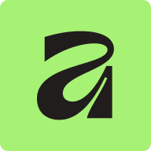

---
tags:
  - 折纸
  - 折图
  - 软件
---
# 软件
绘制折图，我们使用Affinity软件。这个软件之前是付费的，但是线上影像设计平台[Canva](https://zh.wikipedia.org/wiki/Canva "Canva")于2024年收购Serif后，采用免费增值模式，因此我们现在已经不需要付费就可以使用它来进行绘制。

---
**Affinity Designer**（简称“**AD**”）是由Serif Europe开发的一款基于Windows与macOS平台的矢量图形设计软件。它是被列进苹果Mac App Store和iTunes Store2014年macOS “Best of 2014”里的app之一，并在2015年荣获 “苹果设计奖”。

Affinity Designer能打开便携式文档格式(PDF)，Adobe Photoshop，Adobe Illustrator的文件，它也能导出那些格式以及可缩放向量图形(SVG)和EPS等格式的文件。

2016年11月，Microsoft Windows版的Affinity Designer开始发售，采用永久授权模式；线上影像设计平台Canva于2024年收购Serif后，采用免费增值模式、整合向量设计、影像编修与版面排版的Affinity于2025年取代Affinity Designer。

[Affinity](https://www.affinity.studio/) | Professional Creative Software, Free for Everyone

1. 进入官网后，点击`Download for free`，此时要准备好网络环境，国内的网络登录Canva账户时，会自动跳转到国内版Canva，导致无法完成正常登录。
	- 
	- 下载链接[Affinity Download](https://www.affinity.studio/download)
	- 运行安装包之后完成账号登录，就可以使用了。
	- 新旧对比：