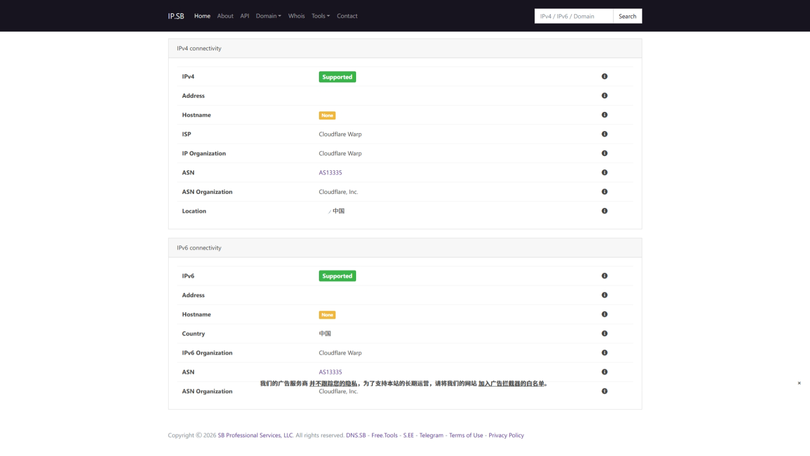

---
tags:
  - 科学上网
  - 节点
---

## 免费软件推荐

1. Android（以下两个软件均可在Google Play下载稳定版本）

- [nthLink](https://www.downloadnth.com/download.html)
- [leafvpn](https://www.kitslabs.com/leafvpn.downloads.html)

2. Windows

- [1.1.1.1——使 Internet 更安全的免费应用。](https://1111-releases.cloudflareclient.com/win/latest)
  - 需科学上网才能访问，可以借助一些免费额度（以上为下载链接，不需要科学上网）
  - MASQUE协议可用
  - 版本2025.6.1400.0更新后变化如下
  - 
- [ikuuu](https://ikuuu.boo/)
  - 目前上午不可用，只有在人工值守时段可用
  - 防失联:发送任意邮件到此邮箱，将会收到最新官网地址（自动回复）[find@ikuuu.pro](mailto:find@ikuuu.pro)
  - 每人每月50G,不够用可以买流量包
  - 大部分节点限速50M(6MB/s)
  - 每月一日重置(仅免费用户,会有延迟)
  - 签到随机赠送流量
  - [邀请链接](https://ikuuu.de/auth/register?code=TAmS)

## Cloudflare自建节点

1. **edgetunnel** 是一个基于 CF Workers/Pages 平台的边缘计算隧道解密方案。它能够高效地处理网络流量，并提供强大的管理面板和灵活的节点配置能力。
   ### ✨ 核心特性
   
   - 🛡️ **协议支持**：支持 VLESS、Trojan 等主流协议，深度集成加密传输。
   - 📊 **管理面板**：内置可视化后台，支持实时配置修改、日志查看及流量统计。
   - 🛠️ **部署灵活**：完整适配 CF Workers 及 CF Pages (GitHub / 上传)。
   - 🔄 **订阅系统**：内置自动订阅生成及混淆转换，适配主流客户端（Clash, Sing-box, Surge 等）。
   - ⚡ **性能加速**：支持自定义 ProxyIP、SOCKS5/HTTP 链式代理及优选 API，优化网络延迟。
   - 🌐 **多台适配**：完美适配 Windows, Android, iOS, MacOS 及各种软路由固件。

## 💡 快速部署

::tip
**详尽图文教程**：[edgetunnel 部署指南](https://cmliussss.com/p/edt2/)
::

::warning
 **Error 1101问题**：[视频解析](https://www.youtube.com/watch?v=r4uVTEJptdE)
::